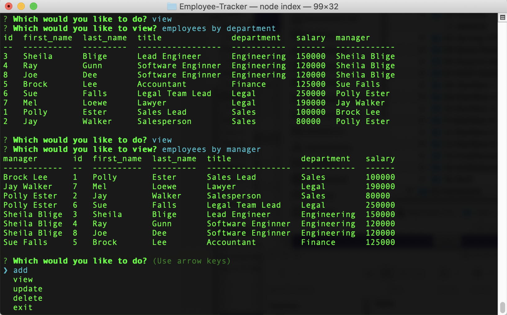

# Employee-Tracker
MySQL Homework: Employee Tracker

## Description

Developers are often tasked with creating interfaces that make it easy for non-developers to view and interact with information stored in databases. Often these interfaces are known as **C**ontent **M**anagement **S**ystems. In this homework assignment, your challenge is to architect and build a solution for managing a company's employees using node, inquirer, and MySQL.

This command-line application allows the user to:

  * View employees by department, employees by manager 

  * Add departments, roles, employees

  * Update employee roles and managers

  * Delete departments, roles, and employees

## Demonstration

## GitHub page

My GitHub page can be found here:

//: chriscrichter GitHub [https://github.com/chriscrichter/](https://github.com/chriscrichter/)

